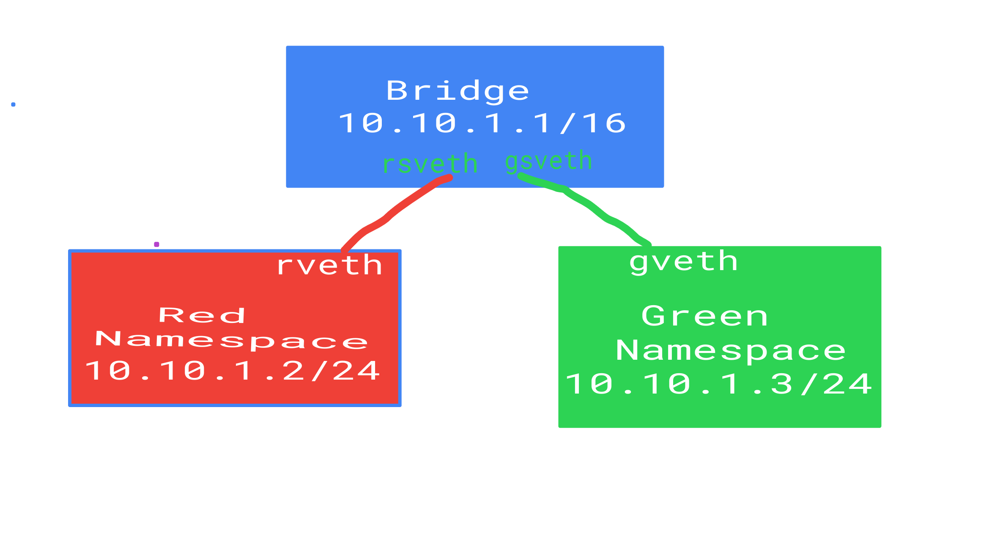

# exam_network_namespace

# Vision
    Make two namespace and connect them through bridge

# show route table
    sudo route

# display information about interfaces currently in operation
ifcofig

# 1.create 2 namespace(red, green)
    sudo ip netns add red
    sudo ip netns add green

# 2. show namespaces
    sudo ip netns list

# 3. create bridge(br1)
    sudo ip link br1 type bridge

# 4.create two virtual ethernet cables
    sudo ip link add rveth type veth peer name rsveth
    sudo ip link add gveth type veth peer name gveth

# 4. up the bridge
    sudo ip link set br1 up

# 5. assign ip addresss on bridge
    sudo ip addr add 10.10.0.1/16 dev br1

# 6. connect virtual ethernet to bridge
    sudo ip link set rsveth master br1
    sudo ip link set gsveth master br1

# 7. up the bridge side virtual ethernet cables
    sudo ip link set rsveth up
    sudo ip link set gsveth up

# 7. set the veth in namespaces(red, green)
    sudo ip link set rveth netns red
    sudo ip link set rveth netns green

# 7. UP the inerfaces in the namespaces(red, green)
    sudo ip netns exec red ip link set lo up
    sudo ip netns exec red ip link set rveth up
    sudo ip netns exec green ip link set lo up
    sudo ip netns exec green ip link set gveth up

# 8. assign ip address to namespaces(red, green)
    sudo ip netns exec red ip address add 10.10.1.2/24 dev rveth
    sudo ip netns exec green ip address add 10.10.1.3/24 dev gveth

# 9. use ping command for communicating 
    sudo ip netns exec red ping 10.10.1.3 (red to green)
    sudo ip netns exec green ping 10.10.1.2 (green to red)